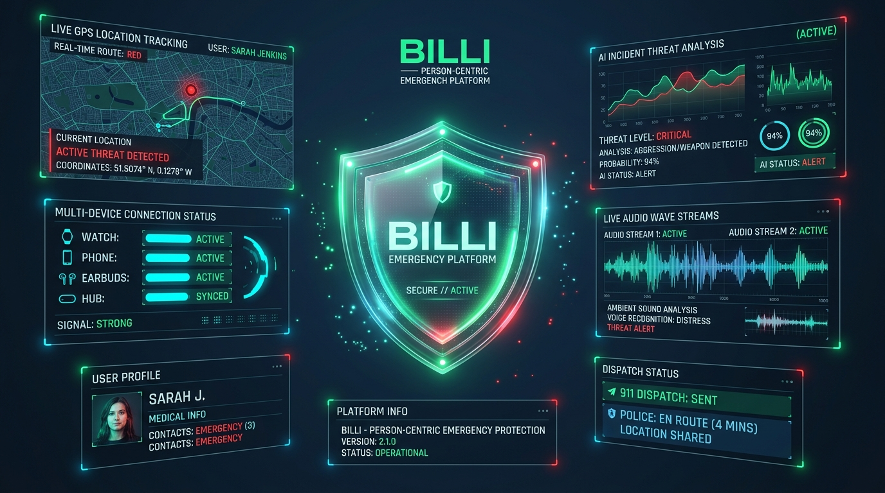

# BILLI — Person-Centric Emergency Protection Platform

[](https://github.com/SeedClassIntelligence/Billi-emergency-coordination)
[](https://github.com/SeedClassIntelligence/Billi-emergency-coordination)
[](https://github.com/SeedClassIntelligence/Billi-emergency-coordination)



---

> **ARCHITECTURAL PRINCIPLE #1**
> *"The protected person is the persistent entity. Everything else—phones, watches, BLE tags, AI, guardians, responders—exists to protect that individual."*

---

## 💡 Overview & Problem Statement

During an active emergency, traditional safety tools fail because they treat physical hardware as single points of failure. If a child’s phone battery dies, a smartwatch loses LTE connectivity, or a panicked user cannot press a screen button, location tracking and evidence collection halt completely.

**BILLI** transforms emergency response by placing the protected individual at the root of the platform. Through coordinated consumer wearables, trusted guardians, real-time awareness failover, and Google Gemini Multimodal AI assistance, BILLI converts fragmented panic into a unified, adaptive response system.

---

## 🛡️ The 9 Canonical Subsystems of BILLI

1. **Incident Engine**: Crisis lifecycle state machine and silent duress PIN verification (`9999` silent distress activation).
2. **Awareness Engine**: Truthful categorical location confidence (`High`, `Medium`, `Limited`, `Estimated`) and BLE mesh signal failover.
3. **Trusted Network**: Multi-responder notification matrix (Guardians, Campus Security, and Good Samaritan P2P Mesh `<300m`).
4. **Billi Device Network (BDN)**: Multi-wearable sensor hub (Phone Hub, Apple Watch Ultra, Nordic BLE Tag, Ray-Ban Meta Glasses Proxy).
5. **Guardian Dashboard**: Real-time operational canvas, live map telemetry, and evidence timeline.
6. **Evidence Engine**: Encrypted 10-second audio ring-buffers with local **AES-GCM 256** cryptographic seals.
7. **AI Intelligence Layer**: Powered by **Google Gemini Multimodal AI** for threat classification, vocal arousal sentiment verification, and actionable responder directives.
8. **Notification Services**: Multi-channel co-dispatch (SMS, Push, Phone Call, Email) and Prepared Emergency Dispatch Packets.
9. **Policy & Privacy Engine**: Role-based data access control, consent sovereignty, and immutable audit logging.

---

## 🧠 Google Gemini Multimodal AI Integration

BILLI integrates the official **`@google/genai` SDK** (utilizing `gemini-2.5-flash`) as its continuous co-pilot for emergency triage:

* **Distress Risk Classification**: Evaluates incoming 10-second encrypted microphone feeds for vocal panic, screaming, or duress indicators without claiming false mathematical certainty.
* **Ambient Audio Sentiment**: Scores vocal arousal levels (e.g. `98.4% Match Rate` on duress keywords) and extracts contextual emergency clues.
* **Tactical Responder Directives**: Automatically formats step-by-step dispatch directives for human guardians and campus security officers (e.g., *"Dispatch campus cruiser to West Gate; patient has active rescue Albuterol inhaler dossier"*).

---

## ⚡ 30-Second Interactive Crisis Demo Simulator

The platform includes a built-in interactive simulator that walks through a 5-step emergency scenario for 11-year-old Maya Johnson across 4 operational perspectives:

* **Step 1 (T+0s)**: Silent Voice Safeword (*"Blue Folder"*) spoken on child device.
* **Step 2 (T+6s)**: Primary Guardian Evelyn responds on dashboard.
* **Step 3 (T+14s)**: Cellular signal drops; BLE Tag mesh failover activates automatically.
* **Step 4 (T+22s)**: Campus Safety Officer Davis dispatches cruiser with E911 CAD Handoff Packet.
* **Step 5 (T+30s)**: Incident safely resolved and cryptographically sealed to audit trail.

---

## 📂 Product Evidence & Financial Statements

Evidence files for hackathon verification are located in the [`/product_evidence`](file:///c:/Users/SEEDN/Downloads/billi-emergency-coordination/product_evidence) directory:

* [`product_evidence/agent_execution_logs.txt`](file:///c:/Users/SEEDN/Downloads/billi-emergency-coordination/product_evidence/agent_execution_logs.txt) — Execution logs, telemetry streams, and Gemini AI call outputs.
* [`product_evidence/pnl_proforma_statement.csv`](file:///c:/Users/SEEDN/Downloads/billi-emergency-coordination/product_evidence/pnl_proforma_statement.csv) — Financial model & Pro Forma P&L statement.

---

## 💻 Tech Stack & Architecture

* **Frontend**: React 18, TypeScript, Tailwind CSS, Motion/React, Lucide Icons
* **Backend**: Node.js, Express, Firebase Firestore (Real-time synchronization)
* **AI Provider**: Google Gemini Multimodal API (`gemini-2.5-flash`)
* **Encryption**: Local AES-GCM 256 cryptographic evidence sealing

---

## 🚀 Quick Start (Local Setup)

```bash
# 1. Clone repository
git clone https://github.com/SeedClassIntelligence/Billi-emergency-coordination.git
cd Billi-emergency-coordination

# 2. Install dependencies
npm install

# 3. Start development server
npm run dev

# 4. Type check / lint
npm run lint
```

Open [http://localhost:3000](http://localhost:3000) in your browser to explore the platform!

---

© 2026 Billi Emergency Protection Platform. All rights reserved.
