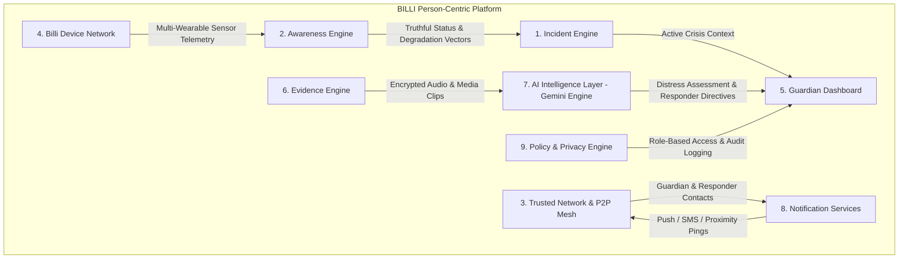

# BILLI — Build with Gemini XPRIZE Submission Package

## Title & Identity
> **BILLI — Person-Centric Emergency Protection Platform**

## Architectural Principle #1
> **The protected person is the persistent entity.**  
> Everything else—phones, watches, BLE tags, AI, guardians, responders—exists to protect that individual.

---

## Mission & Vision

* **Mission**: *Billi was developed to protect you better.*
* **Vision**: *Create a world where every protected person can be reached, understood, and supported faster during an emergency through trusted people, trusted devices, and trusted information.*

## Platform Description
> **Billi is an emergency protection platform built around one persistent entity—the protected person. Through coordinated devices, trusted responders, real-time awareness, and intelligent assistance, Billi transforms fragmented emergency communication into a unified, adaptive response system.**

---

## Platform in 1 Minute (Flow Architecture)

```text
Protected Person (Persistent Root Node)
        │
        ▼
Emergency Trigger (Phone, Apple Watch, BLE Tag, Audio Glasses)
        │
        ▼
1. Incident Engine (State Machine & Silent Duress Verification)
        │
        ▼
2. Awareness Engine (Protection Status & Location Confidence: High/Med/Limited)
        │
        ▼
3. Trusted Network & Proximity Good Samaritan Mesh (<300m)
        │
        ▼
4. Guardian Dashboard (Shared Real-Time Operational Canvas)
        │
        ▼
5. Emergency Services & Prepared Dispatch Packet
        │
        ▼
Safe Resolution
```

---

## Canonical 9-Subsystem Architecture Hierarchy

```text
BILLI (Person-Centric Emergency Protection Platform)
│
├── 1. Incident Engine (State Lifecycle, Duress Verification, Resolution)
├── 2. Awareness Engine (Protection Status, Categorical Location Confidence: High/Med/Limited/Estimated)
├── 3. Trusted Network (Guardians, Campus Safety, Proximity Good Samaritan P2P Mesh)
├── 4. Billi Device Network (Phone Core, Apple Watch, BLE Tag, Audio Glasses)
├── 5. Guardian Dashboard (Real-Time Coordination Canvas, Telemetry, Evidence Feed)
├── 6. Evidence Engine (Encrypted Audio Ring-Buffers, Photo Captures, Cryptographic Seals)
├── 7. AI Intelligence Layer (Provider-Agnostic Engine; Current Implementation: Google Gemini Multimodal)
├── 8. Notification Services (Push, SMS, Audio Warnings, Multi-Channel Handoff)
└── 9. Policy & Privacy Engine (Role-Based Visibility, Access Control, Retention, Consent & Audit Logs)
```



---

## Subsystem Deep Dives

### Section 1: BILLI Platform Overview
Billi transforms an emergency from a collection of disconnected notifications into a single, **shared incident canvas** that coordinates everyone who is supposed to respond—guardians, school administrators, campus security officers, and local Good Samaritan helpers.

### Section 2: Incident Engine
- Manages crisis state transitions (`activated`, `alerting`, `active`, `responder_dispatched`, `safe`, `duress_canceled`, `closed`).
- Implements duress code verification: if forced to cancel an alert under threat, entering a silent duress code keeps guardians secretly alerted while appearing to dismiss the emergency locally.

### Section 3: Awareness Engine
- Computes real-time **Protection Status** (`Strong`, `High`, `Reduced`, `Limited`, `Unavailable`) and **Categorical Location Confidence** (`High`, `Medium`, `Limited`, `Estimated`).
- Implements **Truthful Signal Degradation**: when cellular or GPS drops, Billi never fabricates coordinates. It relies on estimated BLE vectors, audio buffers, and last known fixes without faking certainty.

### Section 4: Trusted Network
- Configurable mesh of guardians, primary parents, caregivers, campus dispatchers, and **Proximity Good Samaritan P2P Mesh**.
- **Proximity Peer-to-Peer Community Safety Mesh**: Sends anonymous, geofenced distress pings to verified nearby Billi app users (<300m) to mobilize on-scene assistance while strictly protecting the child's identity via Role-Based Privacy Controls.

### Section 5: Billi Device Network
- Multi-device wearable hub integrating iPhone/Android core, Apple Watch, Billi BLE Smart Tag, and Smart Audio Glasses.
- Decouples hardware from signaling so any wearable can trigger silent alerts.

### Section 6: Guardian Dashboard
- Live operational dashboard giving primary guardians immediate visual clarity, real-time map positions, evidence timelines, and 1-tap responder escalation.

### Section 7: Evidence Engine
- Captures ambient microphone audio in 10-second rolling buffers and seals files cryptographically with local AES-GCM 256 encryption before cloud uplink.

### Section 8: AI Intelligence Layer (Google Gemini Multimodal)
- Designed as a provider-agnostic intelligence interface (currently powered by `@google/genai` SDK and structured JSON Schema output).
- Automatically analyzes environmental audio transcripts, provides **AI-Assisted Distress Assessment**, extracts key observations, generates **Actionable Responder Directives** (e.g. *"Prepare Albuterol inhaler"*), and provides instant cross-lingual translation (Spanish/French) for municipal handoff.

### Section 9: Notification Services
- High-priority crisis delivery engine managing escalation timeouts, proximity P2P geofenced beacons, and structured emergency dispatch handoffs.

### Section 10: Policy & Privacy Engine
- Governs role-based visibility matrix (Primary Guardian full access vs. Campus Security geofence access vs. Anonymous Proximity ping), data retention limits, consent toggles, and immutable audit logs.

---

## Build with Gemini XPRIZE Judge Presentation Script (2-Minute Video)

```text
[0:00 - 0:20] THE PROBLEM & VISION
"Every year, thousands of emergencies occur where every second counts. Current emergency tools send fragmented, one-way text alerts. But when a child is in danger, parents and responders need a shared operational picture. Architectural Principle #1: The protected person is the persistent entity."

[0:20 - 0:45] THE SOLUTION: BILLI
"Meet BILLI—the Person-Centric Emergency Protection Platform. Billi transforms fragmented emergency communication into a unified, adaptive response system through coordinated devices, trusted responders, real-time awareness, and intelligent assistance."

[0:45 - 1:15] LIVE DEMO & SILENT ACTIVATION
"Watch what happens when Maya speaks her silent code phrase: 'Blue Folder'. Instantly, Billi activates. The Evidence Engine streams encrypted audio, and the AI Intelligence Layer analyzes the transcript in real time—evaluating distress cues, extracting key observations, and issuing actionable directives to School Safety Officers."

[1:15 - 1:40] GRACEFUL DEGRADATION, P2P MESH & PREPARED DISPATCH
"Even if Maya's phone drops offline, Billi's Awareness Engine doesn't fake coordinates. It seamlessly shifts to estimated BLE vectors, alerts nearby Good Samaritan app users within 300 meters, and prepares a structured Emergency CAD Packet for compatible dispatch workflows."

[1:40 - 2:00] CONCLUSION & MISSION
"Billi was developed to protect you better. Powered by Google Gemini, Billi turns panic into coordinated action. Thank you."
```
