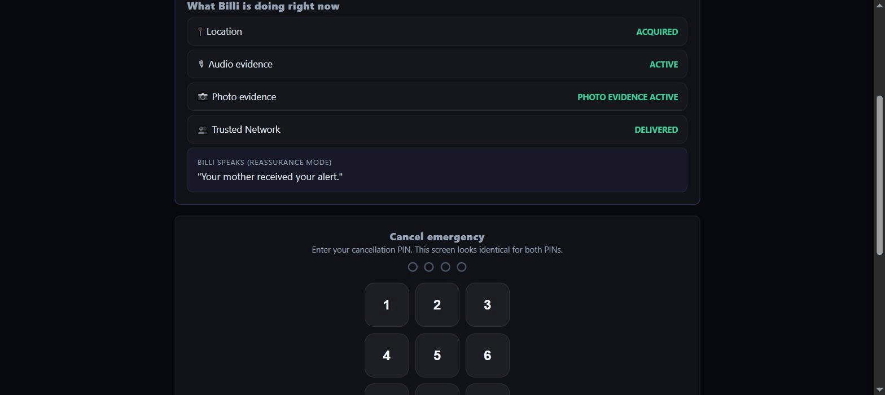

# Billi

**Lone-worker protection for the smallest businesses in the economy.**

A rideshare driver alone in a car with a stranger. A home health aide entering an unfamiliar
home. A contractor on a site with nobody else there. A trucker parked overnight three hundred
miles from anyone who knows him. These people work alone, they *are* the business, and none of
them has what a corporate employee has — a security desk, a duress alarm, a colleague who
notices they didn't come back.

Billi gives them one. **One trigger fires four things at once** — location, audio evidence,
photo evidence, and the trusted network — while live Gemini reasoning assesses the situation and
a separate deterministic rule engine decides what actually executes.

**AI recommends. The rules decide.**

The same platform protects families, on the same account. The architecture doesn't change: the
protected person is the persistent entity, and everything else exists to serve that one
individual.



*Real screen capture against the live backend — the incident IDs, trusted-network delivery
states and Gemini analysis in those frames are genuine output, not a mockup.*

---

## Try it — no install, no login gate

**<https://billi-platform-467802610371.us-central1.run.app/landing.html>**

Anyone can create an account and run a real incident end to end. Each link below launches that
scenario immediately, drops you on the protected person's real screen, and walks you through the
actual product with a guide bar naming what to watch. 60–90 seconds each.

| Scenario | Who's alone | What it proves |
|---|---|---|
| **[01 — Rideshare driver](https://billi-platform-467802610371.us-central1.run.app/landing.html?demo=1)** | Andre, night shift, passenger in the car | Safe word · duress defense · coerced cancellation |
| **[02 — A child](https://billi-platform-467802610371.us-central1.run.app/landing.html?demo=2)** | Maya, 11, left her school safe zone | Safe word · the full 45-second escalation ladder |
| **[03 — A fall at home](https://billi-platform-467802610371.us-central1.run.app/landing.html?demo=3)** | Robert, 78, no answer | Sensor trigger · 10-second safe-fail window · medical dossier |
| **[04 — Crash on a delivery route](https://billi-platform-467802610371.us-central1.run.app/landing.html?demo=4)** | David, contract courier | Automatic activation · signal-loss failover |
| **[05 — Silent, on campus](https://billi-platform-467802610371.us-central1.run.app/landing.html?demo=5)** | Jasmine, 20, after dark | Silent activation · phone power-off fallback |
| **[06 — Long haul, 2 a.m.](https://billi-platform-467802610371.us-central1.run.app/landing.html?demo=6)** | Ray, 52, owner-operator | Wearable trigger · medical dossier for strangers · 911-ready packet |

Scenario 06 is the one to open if you only open one — it's the only demo where the first person
to reach the protected person has never met him, which is what the 911-ready packet exists for.

**Cold start is real.** The service scales to zero. The first request after an idle period
returns a gateway error for 15–60 seconds while all 13 internal services boot. Open the link a
couple of minutes before presenting, or see [DEPLOY.md](DEPLOY.md) for keeping an instance warm.

**Android app:** the landing page serves `/billi.apk` — a native shell
([mobile-native/](mobile-native/)) wrapping the same site, adding the one thing no browser can do
on any platform: sending a real SMS through the phone's own SIM the moment an incident triggers.
Sideloaded, so Android shows an unknown-developer warning; the install flow walks through it.

---

## Where Gemini actually runs

Six routes in `services/context-engine`, all real `@google/genai` calls, all with a deterministic
fallback that is **labelled honestly in the UI** rather than silently substituted:

| Route | What it does | Where you see it |
|---|---|---|
| `/context/synthesize` | Severity + recommended actions at activation | Feeds the rule engine; `AI_CONTEXT_SYNTHESIS` in the timeline |
| `/context/analyze` | Structured 911/CAD analysis — risk, category, distress verification, responder directives | "Audio sentiment analysis" card |
| `/context/summarize` | Plain-language incident summary | "AI-assisted summary" card |
| `/context/analyze-photo` | **Multimodal** — reasons over a sealed camera frame | Evidence panel |
| `/context/review-setup` | Reviews your configuration *before* anything goes wrong | Onboarding step 9, Settings |
| `/context/translate` | Translates Billi's spoken reassurance | Protected person's device |

**AI recommends, the rules decide.** Gemini never executes anything. It returns
recommendations; `orchestration-engine` validates each one against the Safety Contract the
guardian configured, and only then approves it. Withhold audio consent and a recommendation to
open the microphone is refused, no matter how confident the model is.

**Two-model failover.** The free tier caps each model separately (5 requests/minute *and* 20/day,
per model). Heavy reasoning goes to `GEMINI_MODEL_PRIMARY`, lighter routes to
`GEMINI_MODEL_LIGHT`, and either falls over to the other before it falls back to deterministic —
so the daily budget is two pools, not one. Responses carry `aiModel`, so the UI names which model
answered rather than just claiming "AI".

---

## Architecture

```
web-app/ (18 pages, plain HTML/CSS/JS, no build step)
        │  talks only to the gateway — no other service is browser-facing
        ▼
services/gateway (:8080)
        │  also owns shared incidents, /api/v1/household/*, and
        │  /api/v1/tester-feedback directly (JSON-file persistence)
        ├─ orchestration-engine (:8081)    state machine, core-actions invariant,
        │                                   AI-recommendation rule engine
        ├─ communication-engine (:8082)    transport selection, delivery state, Twilio SMS
        ├─ incident-timeline (:8083)       append-only event log
        ├─ feedback-engine (:8084)         post-incident review
        ├─ identity-service (:8085)        protected-person profiles
        ├─ safety-protocol (:8086)         Safety Contract rules, geofence evaluation
        ├─ emergency-packet (:8087)        Living Emergency Packet + CAD serialization
        ├─ capability-registry (:8088)     device/sensor inventory
        ├─ context-engine (:8089)          the six Gemini routes above
        ├─ telemetry-processor (:8090)     real device telemetry ingest
        ├─ action-execution-engine (:8091) dispatches approved actions
        └─ observability (:8092)           service health, tracing
```

Every service is a small Express/TypeScript process with its own atomic-write JSON persistence
(`.data/` per service) — no external database needed to run the whole platform locally. Guardian,
protected-person and responder sessions share one incident over SSE, so an acknowledgement on one
device appears on the others without a refresh.

---

## What's real, and what isn't

| Capability | State |
|---|---|
| Incident lifecycle, Safety Contract, trusted network, duress branch, escalation ladder | Real, backend-verified |
| Shared incident state across guardian / protected / responder sessions | Real — SSE through the gateway |
| Gemini synthesis, analysis, summarization, photo vision, setup review, translation | Real when `GEMINI_API_KEY` is set; honest labelled fallback otherwise |
| GPS, motion, audio recording, camera stills, speech output | Real, via browser APIs (`web-app/billi-adapters.js`) — needs HTTPS |
| Safe zones with exit-breach detection | Real Haversine distance math, accuracy-aware — runs while Billi is open |
| SMS to trusted contacts | Real. Free via `SmsManager` on the phone's own SIM with the Android app; Twilio gateway fallback otherwise. iOS can never get the native path — Apple permits no third-party app to send SMS without a manual tap |
| Second-device invite (one account covers work and family) | Real — backend-persisted, verified end to end |
| Photo evidence | Real capture and real Gemini vision. Image bytes stay on the capturing device; only the AI description crosses the network |
| Live 911 / CAD dispatch | **Not integrated.** The packet is an export a human hands over |
| Push notifications, BLE mesh relay | Strategy selection is real; the radio and push transport are not |
| Watches, BLE tags, smart glasses | Represented in the interface, not connected as live hardware. Your phone is the real sensor |

---

## Quick start

```bash
npm start
```

Boots all 13 services plus an HTTPS server. Wait for
`✓ BILLI PLATFORM READY — 13/13 services connected`, then open:

- **Phone-ready (HTTPS, unlocks real GPS/mic/camera):** `https://localhost:8443/landing.html`
- **Desktop:** `http://localhost:8443/landing.html`

`Ctrl+C` stops everything.

### Configuration

Copy `.env.example` to `.env`:

- `GEMINI_API_KEY` — free from [aistudio.google.com/apikey](https://aistudio.google.com/apikey).
  **Platform-level config**, not per-user: one key serves every session and role.
- `GEMINI_MODEL_PRIMARY` / `GEMINI_MODEL_LIGHT` — optional model overrides. On a paid tier, point
  both at the same premium model.
- `ADMIN_KEY` — gates `GET /api/v1/tester-feedback`. Unset, that route stays closed rather than
  silently open; feedback can still be submitted.
- `TWILIO_*` — enables the SMS gateway fallback for non-Android devices.

### Tests

```bash
npm test
```

29 tests over the safety-critical logic: readiness gating, the duress/PIN matrix, the
accidental-trigger confirmation window, safe-zone breach detection, and the scenario/guided-tour
contract. Node's built-in runner — no test framework, in keeping with the project having no build
step anywhere.

---

## Project structure

```
.
├── start-all.js       # One command, all 13 services + HTTPS server (local dev)
├── start-cloud.js     # Cloud Run entry point — same services, plain-HTTP server
├── Dockerfile         # Single container; compiles every service ahead of time
├── services/          # The 13 backend microservices
├── web-app/           # Frontend — 18 pages, plain HTML/CSS/JS
│   ├── billi-core.js      # State engine, incident model, scenario packs, guided tour
│   ├── billi-adapters.js  # Capability Adapter Layer — real GPS/motion/audio/camera
│   └── billi.apk          # Native Android build, served for download
├── mobile-native/     # Android shell (WebView + SmsManager bridge)
├── packages/          # Shared TypeScript contracts + demo fixtures
├── product_evidence/  # Real production traces, API records, current-UI capture
└── tools/             # HTTPS dev server, Cloud Run server
```

## Documentation

| Document | What it covers |
|---|---|
| [XPRIZE_SUBMISSION.md](XPRIZE_SUBMISSION.md) | The submission — business viability, AI-native operations, category impact |
| [DEMO_SCRIPT.md](DEMO_SCRIPT.md) | Guided walkthrough, every Gemini touchpoint, what to say if quota runs out |
| [VIDEO_SHOT_LIST.md](VIDEO_SHOT_LIST.md) | Timed 3-minute recording script |
| [DEPLOY.md](DEPLOY.md) | Cloud Run deploy, in three pastes |
| [COPY_DIRECTION.md](COPY_DIRECTION.md) | Website copy direction and voice rules |
| [MOBILE_CAPABILITY_EXECUTION_MATRIX.md](MOBILE_CAPABILITY_EXECUTION_MATRIX.md) | Capability-by-capability: wired to native APIs today vs. what a native app still needs |
| [PLATFORM_DESIGN_BUILD_REPORT.md](PLATFORM_DESIGN_BUILD_REPORT.md) | Build history and verification log |
| [product_evidence/](product_evidence/) | Real captured production traces and raw API responses |

`archive/` holds two earlier, no-longer-running generations (a React+Firebase monolith and a
2-service Cloud Run design), kept for reference — real logic was ported out of the monolith where
useful, such as the Gemini 911/CAD analysis schema. `infrastructure/` holds cloud architecture
that is designed but not applied; its README draws the line between what runs and what is
planned. `services/` is the one complete, currently running system.
