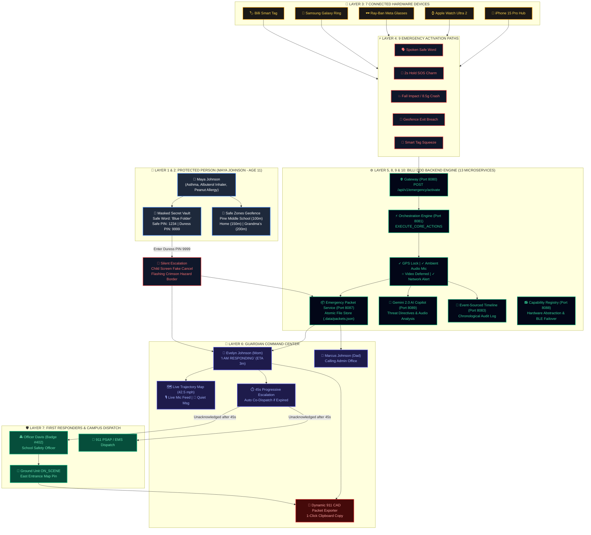

# BILLI PLATFORM MASTER EXECUTION GRAPH

**Document Date:** 2026-08-01  
**Status:** Single Source of Truth Blueprint  
**Target Repository:** `c:\Users\SEEDN\Downloads\Billi-emergency-coordination-main`  

---

## 🎨 THE 60-SECOND BILLI MASTER EXECUTIVE DIAGRAM



---

## 🏛️ PART 1: THE 10 OPERATIONAL LAYERS OF BILLI

```text
┌──────────────────────────────────────────────────────────────────────────────────────────┐
│ LAYER 1  — PEOPLE              (Protected Person, Guardians, Responder, Circle, Auditor) │
├──────────────────────────────────────────────────────────────────────────────────────────┤
│ LAYER 2  — SAFETY CONTRACT     (Dossier, Medical, Safe Words, PINs, Geofences, Network)  │
├──────────────────────────────────────────────────────────────────────────────────────────┤
│ LAYER 3  — DEVICES             (Phone, Watch, Ring, Vehicle, Tag, Glasses, Headphones)   │
├──────────────────────────────────────────────────────────────────────────────────────────┤
│ LAYER 4  — DETECTION           (Voice, SOS Button, Crash, Fall, Motion, Noise, Geofence) │
├──────────────────────────────────────────────────────────────────────────────────────────┤
│ LAYER 5  — ORCHESTRATION       (Trigger ➔ EXECUTE_CORE_ACTIONS ➔ Packet ➔ Dispatch)     │
├──────────────────────────────────────────────────────────────────────────────────────────┤
│ LAYER 6  — GUARDIAN OPERATIONS (Live Map, ETA, Route, Call, Quiet Msg, Audio, CAD)       │
├──────────────────────────────────────────────────────────────────────────────────────────┤
│ LAYER 7  — RESPONDER OPS       (Campus Officer, Police, EMS, 911 PSAP, Ground Unit)      │
├──────────────────────────────────────────────────────────────────────────────────────────┤
│ LAYER 8  — AI INTELLIGENCE     (Gemini 2.0, Threat Classify, Voice Analysis, Summaries)  │
├──────────────────────────────────────────────────────────────────────────────────────────┤
│ LAYER 9  — PERSISTENCE         (Identity, Timeline, Packets, Atomic Disk, Recovery)      │
├──────────────────────────────────────────────────────────────────────────────────────────┤
│ LAYER 10 — VERIFICATION        (Parity Suites, Microservice Suites, Recovery Suites)    │
└──────────────────────────────────────────────────────────────────────────────────────────┘
```

---

### Layer 1 — People
Everything related to humans:
- **Maya Johnson** (Protected Individual, Age 11, Mild Asthma, rescue Albuterol inhaler, Peanut allergy).
- **Evelyn Johnson** (Primary Guardian, Mother, Priority 1, `+15550192834`).
- **Marcus Johnson** (Secondary Guardian, Father, Priority 2, `+15550199988`).
- **Officer Davis** (Campus Safety Officer, Badge #402, Priority 3, `+15550114022`).
- **Grandma Clara** (Extended Circle, Grandmother, Priority 4, `+15550183321`).
- **System Evaluator** (Platform Auditor / Developer, Crisis Simulator & Audit Dock).

---

### Layer 2 — Safety Contract
Everything configured before an emergency:
- Protected person medical dossier & emergency instructions.
- Pre-authorized sensor permissions (GPS high accuracy, ambient mic recording, BLE peer scanning, network dispatch).
- Spoken safe words: `"Blue Folder"`, `"Call Grandma"`, `"Billi Now"`, `"Code cobalt silent"`.
- Dual PIN rules: Safe PIN `1234` (Normal safe cancel) vs Duress PIN `9999` (Silent escalation + flashing crimson hazard border).
- Geofences: Pine Middle School (100m radius), Home Zone (150m radius), Grandma Clara's House (200m radius).
- Trusted Network roles and notification channels (SMS, Push, Voice Call, Multi-Broadcast).

---

### Layer 3 — Devices
Everything capable of generating telemetry data:
- **iPhone 15 Pro Hub** (Primary Gateway: GPS, BLE, Mic, Camera, Cellular, Wi-Fi, Accelerometer, Gyroscope).
- **Apple Watch Ultra 2** (Double-tap gesture, hard fall impact sensor, heart rate spike, secondary GPS).
- **Garmin Fenix 7 Pro** (Double-button hotkey squeeze, crash decelerometer).
- **Samsung Galaxy Ring** (Double pinch gesture SOS, heart rate monitor, BLE beacon).
- **Pixel Watch 3 LTE** (High-G decelerometer, LTE satellite backup tunnel).
- **Ray-Ban Meta Smart Glasses** (Spoken voice phrase command, ambient microphone stream, photo capture).
- **Sennheiser Accentum** (Dual-channel voice wakeup matcher, noise suppression).
- **Billi Smart Tag** (Tactile button squeeze, BLE peer beacon, crash accelerometer).
- **Automotive Vehicle Unit** (8.5g crash decelerometer, airbag sensor, seat occupancy).

---

### Layer 4 — Detection
Everything capable of initiating Billi:
- Spoken Safe Word Keyword Match (`"Blue Folder"`).
- 2-Second Hold SOS Charm Button Press.
- Smartwatch Hard Fall Impact (15s unresponsive countdown).
- Automotive High-G Crash Sensor (8.5g decelerometer spike).
- Geofence Exit Breach (crossing Pine Middle School perimeter at 18+ mph).
- Billi Smart Tag Tactile Squeeze.
- Accessibility Volume Rocker Shortcut.
- Wearable Gesture Match (Apple Watch double-tap / Galaxy Ring double-pinch).
- Acoustic Noise Spike (> 80dB noise threshold).

---

### Layer 5 — Orchestration
Exactly what happens during an emergency execution sequence:
```text
TRIGGER INGRESS 
   ↓ (POST /api/v1/emergency/activate)
GATEWAY (Port 8080) 
   ↓ (Route to Orchestration Engine)
EXECUTE_CORE_ACTIONS (Port 8081)
   ├── 1. Acquire High-Precision GPS Lock (37.7753, -122.4201)
   ├── 2. Start Live Ambient Microphone Stream (Buffer active)
   ├── 3. Defer Video Capture (Truthful prototype state: Video unavailable)
   └── 4. Create Living Emergency Packet (Port 8087)
   ↓
DISPATCH TRUSTED NETWORK ALERTS (Port 8082)
   ├── Priority 1: Evelyn Johnson (Mom) Push + SMS
   ├── Priority 2: Marcus Johnson (Dad) SMS
   ├── Priority 3: Officer Davis (Campus) Push
   └── Priority 4: Grandma Clara Voice Call
   ↓
APPEND INCIDENT TIMELINE (Port 8083)
   ↓
START 45-SECOND ESCALATION TIMER (Port 8081)
   ├── Acknowledged ➔ Transition to HELP_RESPONDING
   └── Unacknowledged (45s expire) ➔ Auto Co-Dispatch Campus Security & 911
```

---

### Layer 6 — Guardian Operations
Everything after notification delivery:
- Real-time GPS location lock, moving speed (42.5 mph SB), and trajectory map header.
- Loved One Dossier (Maya's Asthma notes, Albuterol inhaler location, Peanut allergy).
- **"I AM RESPONDING"** action button (Calculates 3m ETA, broadcasts acknowledgment to Maya).
- Tactical actions: Live Route Guidance, Direct Phone Uplink ("Call Maya"), Send Quiet Message, Monitor Live Mic Feed, Export 911 CAD Packet.
- Contact Response Matrix (Mom `Driving ETA 3m`, Dad `Calling`, Officer Davis `Searching`, Grandma Clara `Alerted`).

---

### Layer 7 — Responder Operations
First responder and campus safety dispatch:
- Campus Safety Officer (Officer Davis, Badge #402) tactical dispatch alert.
- **DISPATCH GROUND UNIT** action (State transitions to `ON_SCENE`).
- Medical dossier access (Maya's Asthma & Albuterol inhaler location).
- Tactical map pin at East Entrance.
- Future integrations: Police CAD PSAP ingestion, 911 call center bridge, EMS dispatch.

---

### Layer 8 — AI Intelligence
Multimodal threat enrichment (No core operation depends solely on AI):
- Google Gemini 2.0 Multimodal AI Copilot (`context-engine` Port 8089).
- Threat classification (`CRITICAL`, `HIGH`, `MEDIUM`).
- Ambient audio noise vector & transcript synthesis.
- Deterministic clean AI fallback summary:
  *"Situation Summary (AI-Assisted • 10:02 AM): Maya activated Billi on Interstate 15 South near Las Vegas. Her device is moving at 42 mph. Her mother Sarah Miller has received the alert. Cellular connection is stable."*

---

### Layer 9 — Persistence
Everything stored across the platform:
- `identity-service` (Port 8085): User identities and guardian bindings.
- `safety-protocol` (Port 8086): Safety contracts, safe words, PIN rules, safe zones.
- `emergency-packet` (Port 8087): Living emergency packets stored with **Atomic File Persistence** (`.data/packets.json`, `.tmp`, `.bak` corruption recovery).
- `incident-timeline` (Port 8083): Event-sourced chronological event stream.
- `feedback-engine` (Port 8084): Post-incident review ratings & notes.
- `observability` (Port 8092): System metrics & audit logs.

---

### Layer 10 — Verification
Automated test suites asserting end-to-end platform integrity:
- Legacy Parity Test Suite (`verification/legacy-capability-parity/legacy_parity_suite.test.ts`).
- Service Execution Audit Suite (`verification/legacy-capability-parity/real_service_execution_audit.test.ts`).
- 9 Microservice Domain Verification Suites (`verification/`).
